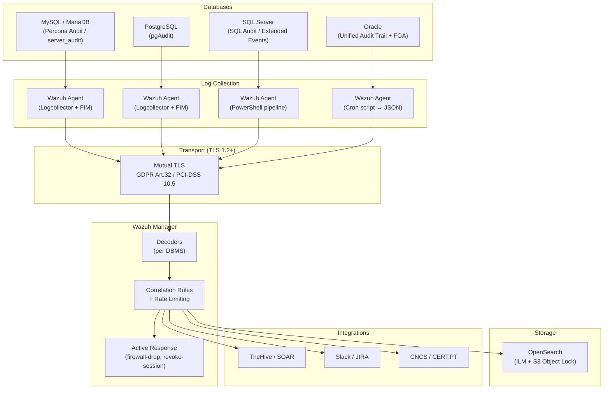

# Wazuh Database Compliance Auditing

> Complete **Database Activity Monitoring (DAM)** platform with Wazuh as the central SIEM — decoders, correlation rules, extraction scripts, and production-ready configurations.

**Supported DBMS:** MySQL/MariaDB · PostgreSQL · Microsoft SQL Server · Oracle

**Compliance:** GDPR · NIS2 · PCI-DSS v4.0 · ISO 27001:2022 · SOX

**Tested on:** Wazuh 4.14.4 (Docker multi-node) · MariaDB 10.11 · PostgreSQL 15/16 · SQL Server 2022

---

## General Architecture



---

## Modules

| Module | Audit Technology | Rule IDs | Complexity |
|--------|-----------------|----------|------------|
| [MySQL / MariaDB](./mysql/README.md) | Percona Audit (JSON) + server_audit (CSV) | 100201–100208, 100260–100263 | Low |
| [PostgreSQL](./postgresql/README.md) | pgAudit via stderr | 100210–100220 | Medium |
| [Oracle](./oracle/README.md) | Unified Audit Trail + FGA | 100230–100251 | High |
| [SQL Server](./mssql/README.md) | SQL Server Audit + Extended Events | 100270–100283 | Medium-High |

---

## Repository Structure

```
wazuh-db-audit/
├── mysql/
│   ├── README.md                 # MySQL/MariaDB guide
│   ├── config/
│   │   ├── my.cnf.snippet        # Percona Audit Plugin (JSON)
│   │   └── logrotate.conf        # Log rotation
│   ├── wazuh/
│   │   ├── decoders/
│   │   │   └── mysql-audit-decoders.xml   # Percona JSON + MariaDB CSV
│   │   └── rules/
│   │       └── mysql-audit-rules.xml      # IDs 100201-100208, 100260-100263
│   ├── scripts/
│   │   └── validate.sh
│   └── tests/
│       ├── sample-logs/
│       └── run-logtest.sh
│
├── postgresql/
│   ├── README.md                 # PostgreSQL + pgAudit guide
│   ├── config/
│   │   ├── postgresql.conf.snippet
│   │   ├── pg_hba.conf.snippet
│   │   └── pgaudit-setup.sql     # Object-level PII auditing
│   ├── wazuh/
│   │   ├── decoders/
│   │   │   └── postgresql-audit-decoders.xml  # pgAudit + connections + auth
│   │   └── rules/
│   │       └── postgresql-audit-rules.xml     # IDs 100210-100220
│   └── tests/
│       ├── sample-logs/
│       └── run-logtest.sh
│
├── mssql/
│   ├── README.md                 # SQL Server guide
│   ├── config/
│   │   ├── deploy-audit.sql      # Auto-discovery audit (all user DBs)
│   │   ├── deploy-pii-audit.sql  # PII column auditing (optional)
│   │   └── create-extended-events.sql # Extended Events (Express edition)
│   ├── scripts/
│   │   ├── mssql-audit-forwarder.ps1  # .sqlaudit → JSON pipeline
│   │   └── deploy-wazuh-audit.ps1     # One-click deploy script
│   ├── wazuh/
│   │   ├── decoders/
│   │   │   └── mssql-audit-decoders.xml   # JSON from PS pipeline
│   │   └── rules/
│   │       └── mssql-audit-rules.xml      # IDs 100270-100283
│   └── tests/
│       ├── sample-logs/
│       └── run-logtest.sh
│
├── oracle/
│   ├── README.md                 # Oracle guide
│   ├── config/
│   │   ├── audit-policy.sql      # Unified Auditing policies
│   │   └── fga-setup.sql         # Fine-Grained Auditing (PII)
│   ├── scripts/
│   │   └── oracle-audit-forwarder.sh  # UAT → JSON extraction
│   ├── wazuh/
│   │   ├── decoders/
│   │   │   └── oracle-audit-decoders.xml  # UAT + FGA
│   │   └── rules/
│   │       └── oracle-audit-rules.xml     # IDs 100230-100251
│   └── tests/
│       ├── sample-logs/
│       └── run-logtest.sh
│
├── shared/
│   ├── active-response/          # Firewall-drop for brute-force
│   ├── agent-conf/               # Centralized agent.conf per group
│   ├── dashboards/               # Dashboard visualization specs
│   ├── integrations/             # TheHive SOAR script (optional)
│   ├── opensearch/               # ISM retention policy
│   ├── scripts/                  # Pipeline health check
│   ├── syscheck/                 # FIM for DB config files
│   └── tls/                      # TLS Agent↔Manager config
│
├── LICENSE                       # MIT License
└── README.md                     # This file
```

---

## Quick Regulatory Mapping

| Regulation | Requirement | Implemented Control |
|------------|-------------|---------------------|
| GDPR Art. 32 | Technical security measures | Logging + anomaly alerts |
| GDPR Art. 33 | Breach notification within 72h | Active Response + TheHive/SOAR |
| NIS2 Art. 21 §2 a) | Risk analysis | Correlation rules + dashboards |
| NIS2 Art. 23 | Incident notification | Automated alerts → CNCS/CERT.PT |
| PCI-DSS 10.2.1 | Individual access logging | Authentication decoders per DBMS |
| PCI-DSS 10.2.5 | Privileged action logging | DDL/DCL rules + privilege escalation |
| PCI-DSS 10.3.4 | Tamper protection | FIM (syscheck) + S3 Object Lock |
| PCI-DSS 10.7 | Minimum 12-month retention | OpenSearch ILM: hot→warm→cold→delete |
| ISO 27001:2022 A.8.15 | Logging and monitoring | Full configuration + UEBA (roadmap) |
| SOX Sec. 404 | IT General Controls | Privilege escalation + 7-year retention |

---

## Technical Notes (Wazuh 4.14)

### json_decoder

When the Wazuh Agent uses `<log_format>json</log_format>`, JSON fields are automatically extracted by the engine — **there is no need for `<plugin>json_decoder</plugin>` in custom decoders** (this element is not supported in custom decoders in version 4.14). Custom decoders only need `<prematch>` to identify the event type.

### Reserved Fields

The following field names are reserved by Wazuh and **cannot be used in `<field name="...">`** in rules: `action`, `status`, `user`, `id`, `url`, `data`, `extra_data`, `systemname`, `srcip`, `dstip`, `protocol`, `srcport`, `dstport`.

If the audit JSON contains fields with these names, the extraction script must rename them (e.g., `action` → `audit_action`, `user` → `audit_user`).

### Regex in Wazuh

Wazuh uses OS_Regex (POSIX), not PCRE. Key differences:
- `\d` → use `[0-9]`
- `\w` → use `[a-zA-Z0-9_]`
- `\s` → use ` ` (literal space) or `.`
- `\[` → **not supported** in prematch (OS_Match)
- `time_after/time_before` → use `<time>10pm - 6am</time>`

### Rule ID Map

| Range | Module | Notes |
|-------|--------|-------|
| 100200–100209 | MySQL (Percona JSON) | Sessions, brute-force, DDL, GRANT, exfiltration |
| 100210–100229 | PostgreSQL | pgAudit classes + connections + auth failures |
| 100230–100259 | Oracle | Unified Audit + FGA |
| 100260–100269 | MariaDB (server_audit) | CONNECT, FAILED_CONNECT, DDL |
| 100270–100299 | Microsoft SQL Server | SQL Audit + Extended Events |

---

## Capacity Planning

| DBMS | Estimated Volume (audit log) | DBMS Overhead | Notes |
|------|------------------------------|---------------|-------|
| MySQL (Percona, LOGINS) | ~50 MB/day (100 logins/min) | ~1-2% latency | SEMISYNCHRONOUS; ALL can generate 10-50 GB/day |
| MariaDB (server_audit) | ~30-100 MB/day | <1% | Depends on configured events |
| PostgreSQL (pgAudit, ddl+role) | ~10-50 MB/day | <1% | read+write on PII tables increases significantly |
| Oracle (UAT) | ~100-500 MB/day | ~2-3% | FGA adds overhead per filtered query |
| SQL Server (Audit) | ~50-200 MB/day | ~2-3% | QUEUE_DELAY=1000 minimizes impact |

**Local retention**: 90 days on disk (logrotate/native rotation) → ~3-15 GB per DBMS

**OpenSearch retention (PCI-DSS 10.7)**: 12 months with ILM → hot (30d) → warm (180d) → cold+snapshot (365d) → delete

## Performance and Tuning

- **Start with minimal auditing** (LOGINS/ddl+role) and expand gradually
- **Monitor overhead** with `pg_stat_statements` (PostgreSQL) or PMM (MySQL)
- **Adjust brute-force thresholds**: default is 5 failures/2 min — environments with many users may need 10-15
- **Off-hours schedule**: default 10pm-6am — adjust according to shifts
- **Exclude service accounts** from audit when they generate too much noise (e.g., monitoring, backup)

---

## Global Prerequisites

- Wazuh Manager 4.9.x
- Wazuh Agent 4.9.x on database hosts
- OpenSearch 2.11+
- Root/sudo access to database servers
- Open ports: 1514/tcp (agent→manager), 1515/tcp (enrollment), 55000/tcp (API)

---

## Operational Components (`shared/`)

| Component | File | Purpose |
|-----------|------|---------|
| TLS Agent↔Manager | `shared/tls/ossec-auth-tls.conf` | In-transit log encryption (GDPR Art.32, PCI-DSS 10.5) |
| Active Response | `shared/active-response/active-response.conf` | Automated containment (firewall-drop, whitelisting) |
| TheHive SOAR | `shared/integrations/custom-thehive.py` | Automatic case creation for DB alerts (optional — requires TheHive installed) |
| ILM OpenSearch | `shared/opensearch/ilm-retention-policy.json` | 12-month retention (PCI-DSS 10.7) |
| Health Check | `shared/scripts/check-db-pipeline.sh` | Pipeline health monitoring |
| Agent Config | `shared/agent-conf/db_{mariadb,postgresql,mssql}.conf` | Centralized per-group configuration |
| FIM/Syscheck | `shared/syscheck/fim-database-configs.conf` | Configuration file integrity |
| Dashboards | `shared/dashboards/dashboard-specs.json` | 8 compliance panels for OpenSearch |

---

## How to Use This Repository

### Implementing auditing for a new DBMS

1. Identify the DBMS type and follow the corresponding module's `README.md`
2. Install decoders: copy `wazuh/decoders/*.xml` to `/var/ossec/etc/decoders/` on the Manager
3. Install rules: copy `wazuh/rules/*.xml` to `/var/ossec/etc/rules/` on the Manager
4. Validate: `/var/ossec/bin/wazuh-analysisd -t`
5. Add the agent to the correct group (db_mariadb, db_postgresql, db_mssql)
6. Apply the group's `agent.conf` (shared/agent-conf/)
7. Test with `tests/run-logtest.sh`

### Checklist for adding a new database

```
[ ] DBMS: audit plugin installed and configured
[ ] DBMS: audit log being generated (verify with tail)
[ ] Wazuh Agent: installed on the host and connected to the Manager
[ ] Wazuh Agent: agent added to the correct db_* group
[ ] Wazuh Agent: agent.conf with localfile for the audit log
[ ] Wazuh Manager: decoders and rules installed and validated
[ ] Test: wazuh-logtest with a real audit log line
[ ] Dashboard: alerts visible in the Wazuh Dashboard
```

> Each module is independent. They can be implemented in any order.
