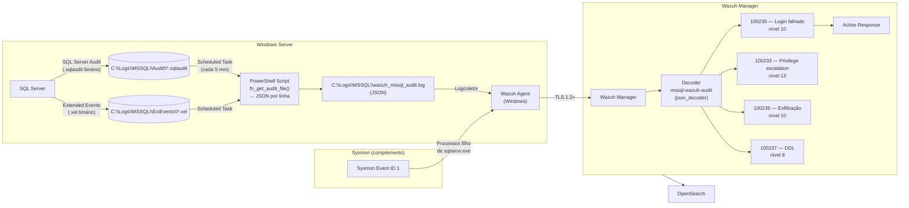
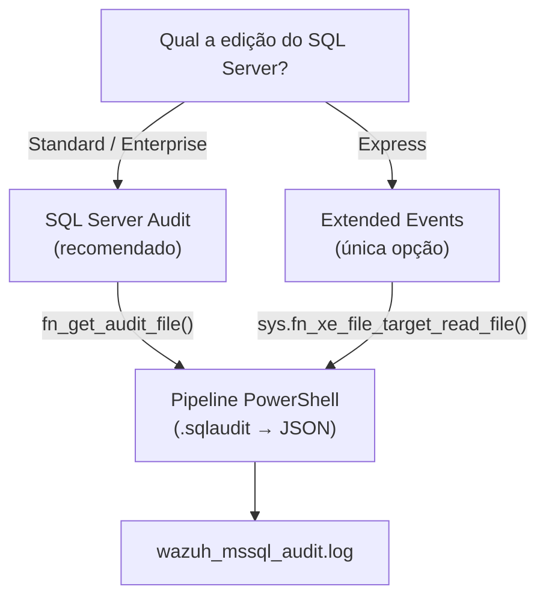

# Módulo Microsoft SQL Server

Implementação de auditoria de conformidade para SQL Server 2019/2022 utilizando **SQL Server Audit** (.sqlaudit) e **Extended Events** (para Express edition), com pipeline de conversão PowerShell para JSON integrado com o Wazuh.

---

## Fluxo de Dados



---

## Decisão: SQL Server Audit vs Extended Events



| Funcionalidade | SQL Server Audit | Extended Events |
|---------------|-----------------|-----------------|
| Edições suportadas | Standard, Enterprise | Todas (incluindo Express) |
| Formato output | .sqlaudit (binário) | .xel (binário) |
| Granularidade | Audit Actions + Groups | Qualquer evento do engine |
| Overhead | Baixo (~2-3%) | Variável (depende dos eventos) |
| Filtros | Audit Specification | Predicados SQL |

---

## Pré-Requisitos

| Componente | Versão mínima | Notas |
|------------|--------------|-------|
| SQL Server | 2019+ | Standard/Enterprise para SQL Audit; Express usa Extended Events |
| PowerShell | 5.1+ | Incluído em Windows Server 2019+ |
| SqlServer module | Mais recente | `Install-Module SqlServer` |
| Wazuh Agent | 4.9.x (Windows) | Instalado no host SQL Server |
| Sysmon | 15+ | Opcional mas recomendado para xp_cmdshell |

---

## Passo 1 — Criar Diretórios

```powershell
# Executar como Administrador no host SQL Server
New-Item -ItemType Directory -Force -Path "C:\Logs\MSSQL\Audit"
New-Item -ItemType Directory -Force -Path "C:\Logs\MSSQL\ExtEvents"
New-Item -ItemType Directory -Force -Path "C:\Logs\MSSQL"

# Dar permissão ao serviço SQL Server
$acl = Get-Acl "C:\Logs\MSSQL"
$sqlService = "NT Service\MSSQLSERVER"  # ajustar se instância nomeada
$rule = New-Object System.Security.AccessControl.FileSystemAccessRule(
    $sqlService, "FullControl", "ContainerInherit,ObjectInherit", "None", "Allow")
$acl.SetAccessRule($rule)
Set-Acl "C:\Logs\MSSQL" $acl
```

---

## Passo 2A — SQL Server Audit (Standard/Enterprise)

```sql
-- Executar no SSMS como sysadmin

-- 1. Criar o Server Audit (destino: ficheiro)
CREATE SERVER AUDIT [WazuhAudit]
TO FILE (
    FILEPATH = N'C:\Logs\MSSQL\Audit',
    MAXSIZE = 100 MB,
    MAX_ROLLOVER_FILES = 10,
    RESERVE_DISK_SPACE = OFF
)
WITH (
    QUEUE_DELAY = 1000,            -- flush a cada 1 segundo
    ON_FAILURE = CONTINUE          -- não parar o SQL se o audit falhar
);
GO

-- 2. Ativar o audit
ALTER SERVER AUDIT [WazuhAudit] WITH (STATE = ON);
GO

-- 3. Server Audit Specification — eventos a nível de servidor
-- Cobre: logins, alterações de privilégios, backup/restore
CREATE SERVER AUDIT SPECIFICATION [WazuhServerSpec]
FOR SERVER AUDIT [WazuhAudit]
    ADD (FAILED_LOGIN_GROUP),                -- PCI-DSS 10.2.4
    ADD (SUCCESSFUL_LOGIN_GROUP),            -- PCI-DSS 10.2.1
    ADD (LOGIN_CHANGE_PASSWORD_GROUP),       -- RGPD Art. 32
    ADD (SERVER_ROLE_MEMBER_CHANGE_GROUP),   -- PCI-DSS 7.1
    ADD (DATABASE_ROLE_MEMBER_CHANGE_GROUP), -- PCI-DSS 7.1
    ADD (SERVER_PERMISSION_CHANGE_GROUP),    -- SOX 404
    ADD (DATABASE_PERMISSION_CHANGE_GROUP),  -- SOX 404
    ADD (BACKUP_RESTORE_GROUP),              -- ISO A.8.15
    ADD (SERVER_PRINCIPAL_CHANGE_GROUP),     -- Gestão de utilizadores
    ADD (SERVER_STATE_CHANGE_GROUP),         -- Start/Stop do servidor
    ADD (AUDIT_CHANGE_GROUP)                 -- Alterações ao próprio audit
WITH (STATE = ON);
GO

-- 4. Database Audit Specification — DDL e acesso a dados
-- Executar por cada base de dados a auditar
USE [SAGA];  -- [AJUSTAR] nome da base de dados
GO

CREATE DATABASE AUDIT SPECIFICATION [WazuhDatabaseSpec]
FOR SERVER AUDIT [WazuhAudit]
    ADD (SCHEMA_OBJECT_CHANGE_GROUP),    -- DDL: CREATE/ALTER/DROP tabelas
    ADD (DATABASE_OBJECT_CHANGE_GROUP),  -- DDL: outros objetos
    ADD (SELECT ON SCHEMA::[dbo] BY [public]),  -- Leituras (volume alto!)
    ADD (INSERT ON SCHEMA::[dbo] BY [public]),  -- Escritas
    ADD (UPDATE ON SCHEMA::[dbo] BY [public]),
    ADD (DELETE ON SCHEMA::[dbo] BY [public]),
    ADD (EXECUTE ON SCHEMA::[dbo] BY [public])  -- Execução de SPs
WITH (STATE = ON);
GO

-- 5. Verificar
SELECT name, type_desc, is_state_enabled
FROM sys.server_audits;

SELECT name, is_state_enabled
FROM sys.server_audit_specifications;

SELECT name, is_state_enabled
FROM sys.database_audit_specifications;
```

---

## Passo 2B — Extended Events (Express Edition)

```sql
-- Para SQL Server Express que não suporta SQL Server Audit
CREATE EVENT SESSION [WazuhAuditExpress] ON SERVER

-- DDL destrutivo
ADD EVENT sqlserver.sql_statement_completed(
    WHERE sqlserver.sql_text LIKE '%DROP%'
       OR sqlserver.sql_text LIKE '%DELETE%'
       OR sqlserver.sql_text LIKE '%TRUNCATE%'
       OR sqlserver.sql_text LIKE '%ALTER%'
       OR sqlserver.sql_text LIKE '%CREATE%'
       OR sqlserver.sql_text LIKE '%GRANT%'
       OR sqlserver.sql_text LIKE '%REVOKE%'
),

-- Logins (sucesso e falha)
ADD EVENT sqlserver.login(
    ACTION(sqlserver.username, sqlserver.client_hostname,
           sqlserver.client_app_name)
),

-- Erros de severidade >= 14 (segurança e acima)
ADD EVENT sqlserver.error_reported(
    WHERE severity >= 14
)

-- Target: ficheiro .xel
ADD TARGET package0.event_file(
    SET filename = N'C:\Logs\MSSQL\ExtEvents\wazuh_xevents.xel',
        max_file_size = (100),          -- MB por ficheiro
        max_rollover_files = (10)
);

ALTER EVENT SESSION [WazuhAuditExpress] ON SERVER STATE = START;

-- Verificar
SELECT name, create_time
FROM sys.server_event_sessions
WHERE name = 'WazuhAuditExpress';
```

---

## Passo 3 — Pipeline de Conversão PowerShell

O script `mssql-audit-forwarder.ps1` extrai eventos dos ficheiros binários (.sqlaudit ou .xel), converte para JSON e escreve para o ficheiro que o Wazuh Agent monitoriza.

```powershell
# Instalar como Scheduled Task:
# - Executar a cada 5 minutos
# - Conta: NT AUTHORITY\SYSTEM (ou conta de serviço com acesso ao SQL)
# - Diretório: C:\Scripts\Wazuh\

# Registar a Scheduled Task:
$action = New-ScheduledTaskAction -Execute "PowerShell.exe" `
    -Argument "-NoProfile -ExecutionPolicy Bypass -File C:\Scripts\Wazuh\mssql-audit-forwarder.ps1"
$trigger = New-ScheduledTaskTrigger -RepetitionInterval (New-TimeSpan -Minutes 5) `
    -Once -At (Get-Date)
$settings = New-ScheduledTaskSettingsSet -ExecutionTimeLimit (New-TimeSpan -Minutes 4)
Register-ScheduledTask -TaskName "WazuhMSSQLAudit" -Action $action `
    -Trigger $trigger -Settings $settings `
    -User "SYSTEM" -RunLevel Highest
```

O script está em `mssql/scripts/mssql-audit-forwarder.ps1`.

---

## Passo 4 — Configurar o Wazuh Agent (Windows)

Editar `C:\Program Files (x86)\ossec-agent\ossec.conf`:

```xml
<ossec_config>

  <!-- Monitorizar o ficheiro JSON gerado pelo pipeline -->
  <localfile>
    <log_format>json</log_format>
    <location>C:\Logs\MSSQL\wazuh_mssql_audit.log</location>
  </localfile>

  <!-- FIM: monitorizar alterações em ficheiros de audit -->
  <syscheck>
    <directories realtime="yes" report_changes="yes">
      C:\Logs\MSSQL\Audit
    </directories>
  </syscheck>

</ossec_config>
```

Reiniciar o agente:

```powershell
Restart-Service WazuhSvc
# Verificar
Get-Service WazuhSvc
Get-Content "C:\Program Files (x86)\ossec-agent\ossec.log" -Tail 20
```

---

## Passo 5 — Sysmon para Deteção de xp_cmdshell

O `xp_cmdshell` permite executar comandos do sistema operativo a partir do SQL Server. É frequentemente explorado em ataques pós-comprometimento. O Sysmon (Event ID 1) captura processos filho de `sqlservr.exe`.

```xml
<!-- Adicionar ao ficheiro de configuração Sysmon existente -->
<RuleGroup name="SQL Server xp_cmdshell Detection" groupRelation="and">
  <ProcessCreate onmatch="include">
    <ParentImage condition="end with">sqlservr.exe</ParentImage>
  </ProcessCreate>
</RuleGroup>
```

```powershell
# Se o Sysmon não estiver instalado:
# Descarregar de https://learn.microsoft.com/en-us/sysinternals/downloads/sysmon
sysmon64.exe -accepteula -i sysmon-config.xml

# Se já estiver instalado, atualizar config:
sysmon64.exe -c sysmon-config.xml
```

O Wazuh Agent já captura eventos Sysmon nativamente (decoder `Sysmon` built-in).

---

## Passo 6 — Instalar Decoder e Regras no Manager

```bash
cp mssql/wazuh/decoders/mssql-audit-decoders.xml \
   /var/ossec/etc/decoders/

cp mssql/wazuh/rules/mssql-audit-rules.xml \
   /var/ossec/etc/rules/

/var/ossec/bin/wazuh-analysisd -t
/var/ossec/bin/ossec-control reload
```

---

## Passo 7 — Validar

```bash
bash mssql/tests/run-logtest.sh
```

---

## Troubleshooting

| Sintoma | Causa provável | Solução |
|---------|---------------|---------|
| Audit não grava | Server Audit com STATE=OFF | `ALTER SERVER AUDIT [WazuhAudit] WITH (STATE = ON);` |
| fn_get_audit_file() falha | Ficheiro locked pelo SQL | Script usa watermark para evitar ficheiro atual |
| JSON malformado | Caracteres especiais em statement | Script faz REPLACE de aspas e newlines |
| Wazuh não lê o log | Path errado no ossec.conf | Verificar `<location>` no ossec.conf |
| Extended Events não arranca | Edição não suporta | `SELECT SERVERPROPERTY('Edition')` |
| Sysmon não deteta xp_cmdshell | Config sem regra ParentImage | Adicionar bloco ProcessCreate para sqlservr.exe |
| Watermark não avança | Sem permissão de escrita | Verificar ACL em C:\Logs\MSSQL |

---

## Referências

- [SQL Server Audit Action Groups](https://learn.microsoft.com/en-us/sql/relational-databases/security/auditing/sql-server-audit-action-groups-and-actions)
- [CREATE EVENT SESSION](https://learn.microsoft.com/en-us/sql/t-sql/statements/create-event-session-transact-sql)
- [fn_get_audit_file()](https://learn.microsoft.com/en-us/sql/relational-databases/system-functions/sys-fn-get-audit-file-transact-sql)
- [Sysmon](https://learn.microsoft.com/en-us/sysinternals/downloads/sysmon)
- PCI-DSS v4.0 — Requirement 10
- RGPD Art. 32.º — Segurança do tratamento
