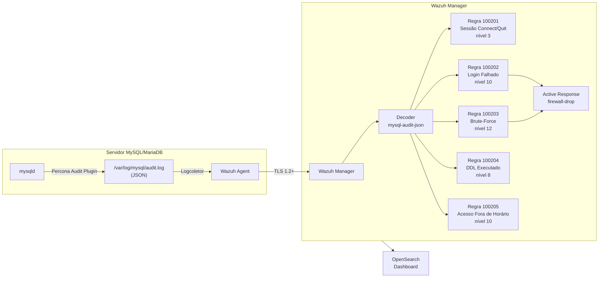

# Módulo MySQL / MariaDB

Implementação de auditoria de conformidade para MySQL 8.0+ e MariaDB 10.6+ utilizando o **Percona Audit Log Plugin** em formato JSON, integrado com o Wazuh.

---

## Fluxo de Dados



---

## Pré-Requisitos

| Componente | Versão mínima | Notas |
|------------|--------------|-------|
| MySQL | 8.0.36+ | Community ou Enterprise |
| MariaDB | 10.6+ | Plugin nativo `server_audit` disponível |
| Percona Audit Log Plugin | 8.0.25+ | Formato JSON requer 8.0.25+ |
| Wazuh Agent | 4.9.x | Instalado no host MySQL |
| Wazuh Manager | 4.9.x | json_decoder suportado desde 3.x |

> **MariaDB**: usa o plugin nativo `server_audit` em vez do Percona. Ver [secção MariaDB](#mariadb-server_audit).

---

## Passo 1 — Instalar o Percona Audit Log Plugin

### Ubuntu / Debian

```bash
# Adicionar repositório Percona
wget https://repo.percona.com/apt/percona-release_latest.generic_all.deb
dpkg -i percona-release_latest.generic_all.deb
percona-release setup ps80
apt-get update

# Instalar apenas o plugin de auditoria (não requer migrar para Percona Server)
apt-get install percona-audit-log-plugin-8.0

# Verificar localização do plugin
mysql -u root -p -e "SHOW VARIABLES LIKE 'plugin_dir';"
# Esperado: /usr/lib/mysql/plugin/ ou /usr/lib64/mysql/plugin/
ls /usr/lib/mysql/plugin/audit_log.so
```

### RHEL / CentOS / Rocky Linux

```bash
yum install https://repo.percona.com/yum/percona-release-latest.noarch.rpm
percona-release setup ps80
yum install percona-audit-log-plugin-8.0

ls /usr/lib64/mysql/plugin/audit_log.so
```

### Docker (MySQL oficial)

```dockerfile
# Dockerfile de extensão
FROM mysql:8.0

# Copiar plugin compilado para o container
COPY audit_log.so /usr/lib/mysql/plugin/
```

```yaml
# docker-compose.yml — adicionar ao serviço mysql
environment:
  MYSQL_ROOT_PASSWORD: ...
command: >
  --plugin-load-add=audit_log.so
  --audit-log-format=JSON
  --audit-log-file=/var/log/mysql/audit.log
  --audit-log-policy=ALL
volumes:
  - mysql_audit_logs:/var/log/mysql
```

---

## Passo 2 — Configurar o Plugin (my.cnf)

Editar `/etc/mysql/mysql.conf.d/mysqld.cnf` (Ubuntu) ou `/etc/my.cnf` (RHEL):

```ini
[mysqld]
# ─── Percona Audit Log Plugin ────────────────────────────────────────────────
# Carregar o plugin ao arranque
plugin-load-add = audit_log.so

# Ficheiro de output — caminho absoluto
audit_log_file = /var/log/mysql/audit.log

# Formato JSON: necessário para o json_decoder do Wazuh processar nativamente
# Alternativa: OLD (CSV legacy), NEW (XML) — evitar
audit_log_format = JSON

# Política de auditoria:
#   ALL      = tudo (verboso, use em dev/QA)
#   LOGINS   = apenas autenticação (PCI-DSS 10.2.1 mínimo)
#   QUERIES  = apenas queries (alto volume)
#   NONE     = desativado
audit_log_policy = LOGINS

# Filtrar por tipo de comando SQL (evita registar cada SELECT)
# Esta lista cobre DDL e gestão de utilizadores (PCI-DSS 10.2.5)
audit_log_include_commands = 'create_table,alter_table,drop_table,\
  create_db,alter_db,drop_db,\
  grant,revoke,\
  create_user,drop_user,alter_user,rename_user,\
  truncate,set_password'

# Rotação automática por tamanho (evitar disco cheio)
audit_log_rotate_on_size = 100M
audit_log_rotations = 10

# Estratégia de escrita: PERFORMANCE (assíncrono) ou SEMISYNCHRONOUS
# SEMISYNCHRONOUS garante entrega mas tem impacto ~2-5% na latência
audit_log_strategy = SEMISYNCHRONOUS
# ─────────────────────────────────────────────────────────────────────────────
```

Reiniciar e verificar:

```bash
systemctl restart mysql

# Confirmar plugin ativo
mysql -u root -p -e "SHOW PLUGINS;" | grep audit
# Esperado: audit_log | ACTIVE | AUDIT | audit_log.so | GPL

# Confirmar formato
mysql -u root -p -e "SHOW VARIABLES LIKE 'audit_log%';"
```

---

## Passo 3 — Verificar Output do Plugin

```bash
# Gerar um evento de teste
mysql -u root -p -e "SELECT 1;"

# Ver o log
tail -5 /var/log/mysql/audit.log
```

Exemplo de linha JSON esperada:

```json
{"audit_record":{"name":"Query","record":"3_2024-01-15T10:30:00","timestamp":"2024-01-15T10:30:01 UTC","command_class":"select","connection_id":"42","status":0,"sqltext":"SELECT 1","user":"root[root] @ localhost []","host":"localhost","os_user":"","ip":"","db":""}}
```

> **Atenção**: cada linha é um objeto JSON independente, não um array. O Wazuh processa linha a linha.

---

## Passo 4 — Configurar Rotação de Logs

Criar `/etc/logrotate.d/mysql-audit`:

```
/var/log/mysql/audit.log {
    daily
    rotate 90
    compress
    delaycompress
    missingok
    notifempty
    copytruncate
    # copytruncate evita reiniciar o mysqld para rodar o log
    # O plugin continua a escrever no ficheiro original enquanto logrotate copia
}
```

Testar:

```bash
logrotate -d /etc/logrotate.d/mysql-audit   # dry-run
logrotate -f /etc/logrotate.d/mysql-audit   # forçar rotação
ls -lh /var/log/mysql/audit.log*
```

---

## Passo 5 — Configurar o Wazuh Agent

Editar `/var/ossec/etc/ossec.conf` no host MySQL:

```xml
<ossec_config>

  <!-- Monitorizar o ficheiro de audit do MySQL -->
  <localfile>
    <log_format>json</log_format>
    <location>/var/log/mysql/audit.log</location>
  </localfile>

  <!-- FIM: detetar alterações nos ficheiros de configuração MySQL -->
  <syscheck>
    <directories realtime="yes" report_changes="yes" check_all="yes">
      /etc/mysql
    </directories>
    <directories realtime="yes" report_changes="yes">
      /var/log/mysql
    </directories>
    <!-- Ignorar o audit.log em crescimento (conteúdo monitorizado via localfile) -->
    <ignore>/var/log/mysql/audit.log</ignore>
  </syscheck>

</ossec_config>
```

Reiniciar o agente:

```bash
systemctl restart wazuh-agent
# Verificar que está a ler o log
tail -f /var/ossec/logs/ossec.log | grep audit
```

---

## Passo 6 — Instalar Decoder e Regras no Manager

No servidor Wazuh Manager:

```bash
# Copiar decoders
cp mysql/wazuh/decoders/mysql-audit-decoders.xml \
   /var/ossec/etc/decoders/mysql-audit-decoders.xml

# Copiar regras
cp mysql/wazuh/rules/mysql-audit-rules.xml \
   /var/ossec/etc/rules/mysql-audit-rules.xml

# Validar sintaxe
/var/ossec/bin/wazuh-analysisd -t
# Saída esperada: "Configuration OK."

# Recarregar regras sem reiniciar o manager
/var/ossec/bin/ossec-control reload
```

---

## Passo 7 — Validar com wazuh-logtest

```bash
# Executar testes automatizados
bash mysql/tests/run-logtest.sh

# Ou testar manualmente:
echo '{"audit_record":{"name":"Connect","record":"1_2024-01-15T10:30:00","timestamp":"2024-01-15T10:30:00 UTC","command_class":"connect","connection_id":"12345","status":0,"sqltext":"","user":"app_user","host":"192.168.1.100","os_user":"","ip":"192.168.1.100","db":"dev_db"}}' \
  | /var/ossec/bin/wazuh-logtest
```

Output esperado para o evento acima:
```
**Phase 1: Completed pre-decoding.
**Phase 2: Completed decoding.
    decoder: 'mysql-audit-json'
    audit_record.name: 'Connect'
    audit_record.user: 'app_user'
    audit_record.host: '192.168.1.100'
    audit_record.status: '0'
**Phase 3: Completed filtering (rules).
    Rule id: '100201'
    Level: '3'
    Description: 'MySQL: Evento de sessão - app_user@192.168.1.100'
    Groups: database,authentication,pci_dss_10.2.1,rgpd_art32
```

---

## MariaDB — server_audit

O MariaDB inclui o plugin `server_audit` nativamente (sem necessitar Percona):

```ini
[mysqld]
# Plugin nativo MariaDB — não requer instalação adicional
plugin-load-add = server_audit

server_audit_logging = ON
server_audit_output_type = file
server_audit_file_path = /var/log/mysql/audit.log

# Eventos a auditar
server_audit_events = CONNECT,QUERY_DDL,TABLE

# Tamanho máximo do ficheiro antes de rodar
server_audit_file_rotate_size = 100M
server_audit_file_rotations = 10
```

> **Nota**: o `server_audit` do MariaDB produz formato CSV/syslog, não JSON. O decoder incluído suporta ambos os formatos — ver `mysql-audit-decoders.xml` para o decoder `mariadb-server-audit`.

---

## Troubleshooting

| Sintoma | Causa provável | Solução |
|---------|---------------|---------|
| Plugin não carrega | `audit_log.so` ausente | `INSTALL PLUGIN audit_log SONAME 'audit_log.so';` |
| Log não cresce | Policy = NONE | `SET GLOBAL audit_log_policy = 'LOGINS';` |
| Wazuh não lê o log | Permissões erradas | `chmod 644 /var/log/mysql/audit.log` |
| Decoder não ativa | JSON mal formado | Verificar com `python3 -m json.tool audit.log` |
| Falsos positivos no AR | IPs de infra não whitelisted | Adicionar à `<white_list>` no ossec.conf do Manager |
| Plugin desaparece após restart | Plugin não em my.cnf | Adicionar `plugin-load-add = audit_log.so` ao `[mysqld]` |

---

## Referências

- [Percona Audit Log Plugin Documentation](https://docs.percona.com/percona-server/8.0/audit-log-plugin.html)
- [MariaDB Server Audit Plugin](https://mariadb.com/kb/en/mariadb-audit-plugin/)
- [Wazuh — Custom Decoders](https://documentation.wazuh.com/current/user-manual/ruleset/custom.html)
- PCI-DSS v4.0 — Requirement 10.2 (Audit Logs)
- RGPD Art. 32.º — Segurança do tratamento
