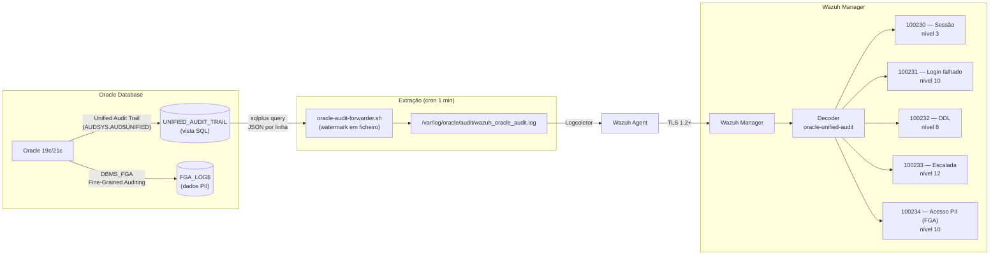

# Módulo Oracle Database

Implementação de auditoria de conformidade para Oracle Database 19c/21c utilizando **Unified Audit Trail (UAT)** e **Fine-Grained Auditing (FGA)**, com extração incremental para o Wazuh via script bash com watermark.

---

## Fluxo de Dados



---

## Pré-Requisitos

| Componente | Versão mínima | Notas |
|------------|--------------|-------|
| Oracle Database | 19c | Unified Auditing em modo exclusivo |
| Oracle Client / sqlplus | 19c+ | Para o script de extração |
| Wazuh Agent | 4.9.x | No host Oracle |
| bash | 4.x | Para o script de extração |
| jq | 1.6+ | Para validação de JSON (opcional) |

---

## Passo 1 — Verificar e Ativar o Unified Auditing

O Oracle pode estar em dois modos de auditoria:

```sql
-- Verificar modo atual
SELECT VALUE FROM V$OPTION WHERE PARAMETER = 'Unified Auditing';
-- TRUE  = Unified Auditing exclusivo (recomendado)
-- FALSE = Mixed mode (legacy + unified simultâneos)
```

### Modo Mixed → Unified Exclusivo

O modo Mixed ocorre tipicamente em bases de dados atualizadas de versões anteriores. **Em Mixed mode, eventos podem ser duplicados ou perdidos.** Recomenda-se fortemente a transição para Unified exclusivo.

> **Aviso**: requer downtime (paragem da base de dados).

```bash
# 1. Parar a base de dados
sqlplus / as sysdba << 'EOF'
SHUTDOWN IMMEDIATE;
EXIT;
EOF

# 2. Ativar Unified Auditing exclusivo
cd $ORACLE_HOME/rdbms/lib
make -f ins_rdbms.mk uniaud_on ioracle
# Este comando reconstrói o binário oracle com unified auditing ativado

# 3. Reiniciar
sqlplus / as sysdba << 'EOF'
STARTUP;
EXIT;
EOF

# 4. Confirmar
sqlplus / as sysdba << 'EOF'
SELECT VALUE FROM V$OPTION WHERE PARAMETER = 'Unified Auditing';
-- Esperado: TRUE
EXIT;
EOF
```

---

## Passo 2 — Criar Políticas de Auditoria

```sql
-- ============================================================
-- Executar como SYSDBA ou utilizador com AUDIT SYSTEM privilege
-- ============================================================

-- ─── Política 1: Sessões e autenticação ─────────────────────
-- Cobre PCI-DSS 10.2.1 e RGPD Art. 32.º
CREATE AUDIT POLICY wazuh_sessions
  ACTIONS LOGON, LOGOFF
  WHEN 'SYS_CONTEXT(''USERENV'', ''SESSION_USER'') != ''SYS'''
  EVALUATE PER SESSION;

AUDIT POLICY wazuh_sessions;

-- ─── Política 2: DDL — Alterações de schema ─────────────────
-- Cobre PCI-DSS 10.2.5, ISO A.8.15
CREATE AUDIT POLICY wazuh_ddl
  ACTIONS
    CREATE TABLE, ALTER TABLE, DROP TABLE,
    CREATE INDEX, DROP INDEX,
    CREATE VIEW, DROP VIEW,
    CREATE PROCEDURE, ALTER PROCEDURE, DROP PROCEDURE,
    CREATE TRIGGER, ALTER TRIGGER, DROP TRIGGER,
    TRUNCATE TABLE,
    CREATE SEQUENCE, DROP SEQUENCE;

AUDIT POLICY wazuh_ddl;

-- ─── Política 3: Gestão de utilizadores e privilégios ────────
-- Cobre PCI-DSS 7.1, SOX 404
CREATE AUDIT POLICY wazuh_privileges
  ACTIONS
    CREATE USER, ALTER USER, DROP USER,
    GRANT, REVOKE,
    CREATE ROLE, ALTER ROLE, DROP ROLE,
    SET ROLE;

AUDIT POLICY wazuh_privileges;

-- ─── Política 4: Acessos de contas privilegiadas ─────────────
-- SYS, SYSTEM, DBA — PCI-DSS 10.2.2
CREATE AUDIT POLICY wazuh_privileged_users
  ACTIONS ALL
  BY SYS, SYSTEM
  EVALUATE PER SESSION;

AUDIT POLICY wazuh_privileged_users;

-- ─── Verificar políticas ativas ─────────────────────────────
SELECT POLICY_NAME, ENABLED_OPT, USER_NAME, SUCCESS, FAILURE
FROM AUDIT_UNIFIED_ENABLED_POLICIES
ORDER BY POLICY_NAME;
```

---

## Passo 3 — Fine-Grained Auditing para Dados PII

O **DBMS_FGA** permite auditar acessos a linhas e colunas específicas — essencial para RGPD Art. 32.º quando existem dados pessoais como NIF, IBAN ou data de nascimento.

```sql
-- ============================================================
-- FGA Setup — Auditoria de colunas com dados pessoais
-- Executar como SYSDBA
-- ============================================================

-- ─── Política FGA: tabela CLIENTES, colunas PII ──────────────
BEGIN
  DBMS_FGA.ADD_POLICY(
    object_schema    => 'APP_SCHEMA',    -- [AJUSTAR] schema da aplicação
    object_name      => 'CLIENTES',
    policy_name      => 'AUDIT_CLIENTES_PII',
    audit_condition  => 'NIF IS NOT NULL OR IBAN IS NOT NULL',
    audit_column     => 'NIF, IBAN, DATA_NASCIMENTO, MORADA',
    handler_module   => NULL,            -- sem handler custom (apenas logging)
    enable           => TRUE,
    statement_types  => 'SELECT, INSERT, UPDATE, DELETE'
  );
END;
/

-- ─── Política FGA: tabela PAGAMENTOS ─────────────────────────
BEGIN
  DBMS_FGA.ADD_POLICY(
    object_schema    => 'APP_SCHEMA',
    object_name      => 'PAGAMENTOS',
    policy_name      => 'AUDIT_PAGAMENTOS_PII',
    audit_condition  => '1=1',           -- auditar todos os acessos
    audit_column     => 'IBAN_DESTINO, MONTANTE, REFERENCIA',
    handler_module   => NULL,
    enable           => TRUE,
    statement_types  => 'SELECT, INSERT, UPDATE, DELETE'
  );
END;
/

-- ─── Verificar políticas FGA ativas ─────────────────────────
SELECT OBJECT_SCHEMA, OBJECT_NAME, POLICY_NAME, ENABLED,
       STATEMENT_TYPES, AUDIT_CONDITION
FROM DBA_AUDIT_POLICIES
ORDER BY OBJECT_NAME;

-- ─── Ver eventos FGA recentes ────────────────────────────────
SELECT TIMESTAMP, DB_USER, OBJECT_SCHEMA, OBJECT_NAME,
       POLICY_NAME, SQL_TEXT, SCN
FROM DBA_FGA_AUDIT_TRAIL
ORDER BY TIMESTAMP DESC
FETCH FIRST 20 ROWS ONLY;
```

---

## Passo 4 — Script de Extração para o Wazuh

O Unified Audit Trail usa ficheiros binários que o Wazuh não pode ler diretamente. O script `oracle-audit-forwarder.sh` extrai os eventos via SQL, converte para JSON e escreve para um ficheiro que o Wazuh Agent monitoriza.

```bash
# Instalar o script
cp oracle/scripts/oracle-audit-forwarder.sh /etc/oracle/
chmod 750 /etc/oracle/oracle-audit-forwarder.sh
chown oracle:oinstall /etc/oracle/oracle-audit-forwarder.sh

# Criar diretório de output
mkdir -p /var/log/oracle/audit
chown oracle:adm /var/log/oracle/audit
chmod 750 /var/log/oracle/audit

# Criar ficheiro de credenciais do utilizador de auditoria
# (separado do SYSDBA para princípio do mínimo privilégio)
echo "wazuh_audit_password" > /etc/oracle/audit_pwd
chmod 400 /etc/oracle/audit_pwd
chown oracle:oinstall /etc/oracle/audit_pwd
```

Configurar cron para execução automática:

```bash
# Editar crontab do utilizador oracle
crontab -u oracle -e

# Adicionar linha:
# Executar a cada 1 minuto — baixa latência para deteção de incidentes
* * * * * /etc/oracle/oracle-audit-forwarder.sh >> /var/log/oracle/audit/forwarder.log 2>&1
```

---

## Passo 5 — Criar Utilizador de Auditoria (Mínimo Privilégio)

```sql
-- Criar utilizador dedicado para o script de extração
-- Nunca usar SYSDBA para o script de produção
CREATE USER wazuh_audit IDENTIFIED BY "CHANGE_ME_strong_password";

-- Permissões mínimas necessárias
GRANT CREATE SESSION TO wazuh_audit;
GRANT SELECT ON UNIFIED_AUDIT_TRAIL TO wazuh_audit;
GRANT SELECT ON DBA_FGA_AUDIT_TRAIL TO wazuh_audit;
GRANT SELECT ON V_$OPTION TO wazuh_audit;

-- Verificar
SELECT * FROM DBA_SYS_PRIVS WHERE GRANTEE = 'WAZUH_AUDIT';
SELECT * FROM DBA_TAB_PRIVS WHERE GRANTEE = 'WAZUH_AUDIT';
```

---

## Passo 6 — Configurar o Wazuh Agent

```xml
<!-- /var/ossec/etc/ossec.conf no host Oracle -->
<ossec_config>

  <!-- Monitorizar o ficheiro JSON gerado pelo script -->
  <localfile>
    <log_format>json</log_format>
    <location>/var/log/oracle/audit/wazuh_oracle_audit.log</location>
  </localfile>

  <!-- FIM: monitorizar ficheiros de configuração Oracle -->
  <syscheck>
    <directories realtime="yes" report_changes="yes" check_all="yes">
      /etc/oracle
    </directories>
    <!-- Monitorizar integridade dos binários Oracle (detetar trojanização) -->
    <directories check_all="yes">
      /u01/app/oracle/product/19.0.0/dbhome_1/bin
    </directories>
    <!-- Ignorar ficheiros de dados em crescimento -->
    <ignore>/var/log/oracle/audit/wazuh_oracle_audit.log</ignore>
  </syscheck>

</ossec_config>
```

---

## Passo 7 — Instalar Decoder e Regras no Manager

```bash
cp oracle/wazuh/decoders/oracle-audit-decoders.xml \
   /var/ossec/etc/decoders/

cp oracle/wazuh/rules/oracle-audit-rules.xml \
   /var/ossec/etc/rules/

/var/ossec/bin/wazuh-analysisd -t
/var/ossec/bin/ossec-control reload
```

---

## Passo 8 — Validar com wazuh-logtest

```bash
bash oracle/tests/run-logtest.sh
```

---

## Troubleshooting

| Sintoma | Causa provável | Solução |
|---------|---------------|---------|
| `V$OPTION` retorna FALSE | Unified Auditing não ativado | Ver Passo 1 — requer downtime |
| Audit Trail não cresce | Política não ativa | `AUDIT POLICY <nome>;` |
| Script falha com ORA-01017 | Password errada ou utilizador bloqueado | `ALTER USER wazuh_audit IDENTIFIED BY nova_pass;` |
| JSON malformado no log | Caracteres especiais em SQL_TEXT | Script faz REPLACE de aspas — verificar `oracle-audit-forwarder.sh` |
| Watermark não avança | Script não tem permissão de escrita | `chown oracle /var/log/oracle/audit/watermark.txt` |
| Eventos duplicados | Mixed mode ainda ativo | Confirmar `V$OPTION Unified Auditing = TRUE` |
| FGA não regista | Política desativada | `EXEC DBMS_FGA.ENABLE_POLICY('APP_SCHEMA','CLIENTES','AUDIT_CLIENTES_PII');` |

---

## Referências

- Oracle Database Security Guide 19c, Chapter 22 — Configuring Audit Policies
- Oracle MOS Doc ID 2409498.1 — Unified Auditing FAQ
- [Oracle DBMS_FGA Reference](https://docs.oracle.com/en/database/oracle/oracle-database/19/arpls/DBMS_FGA.html)
- PCI-DSS v4.0 — Requirement 10
- RGPD Art. 32.º — Segurança do tratamento
