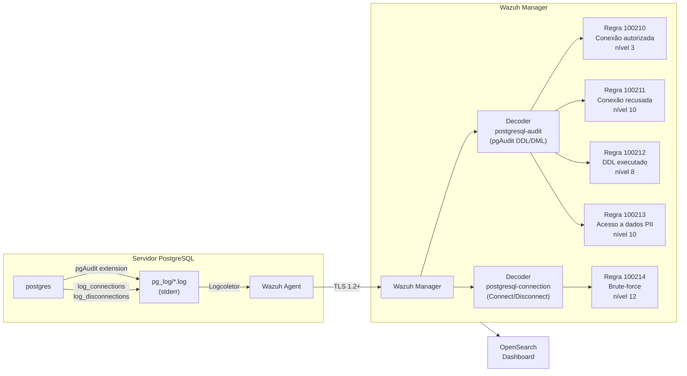

# Módulo PostgreSQL

Implementação de auditoria de conformidade para PostgreSQL 15/16 utilizando a extensão **pgAudit** com output via stderr (ficheiro de log) ou syslog, integrada com o Wazuh.

> **Nota**: Este guia documenta ambos os métodos (stderr e syslog). O ambiente de produção validado (sig-postgres) usa **stderr** com ficheiros em `pg_log/`. O método syslog é uma alternativa para ambientes que já usam rsyslog centralizado.

---

## Fluxo de Dados



---

## Compatibilidade de Versões

| PostgreSQL | pgAudit | Notas |
|------------|---------|-------|
| 16 | 16.0 | Recomendado |
| 15 | 1.7.x | Compatível |
| 14 | 1.6.x | Suportado |
| 13 | 1.5.x | EOL em breve |

> **Aviso crítico**: versões incompatíveis de pgAudit causam falha de carregamento **silenciosa** — o PostgreSQL arranca normalmente mas sem qualquer auditoria ativa. Sempre verificar com a query de validação no Passo 3.

---

## Pré-Requisitos

| Componente | Versão mínima | Notas |
|------------|--------------|-------|
| PostgreSQL | 15+ | |
| pgAudit | 1.7.x (PG15), 16.x (PG16) | Versão tem de coincidir com PG |
| rsyslog | 8+ | Opcional — apenas se usar log_destination=syslog |
| Wazuh Agent | 4.9.x | No host PostgreSQL |

---

## Passo 1 — Instalar o pgAudit

### Ubuntu / Debian

```bash
# PostgreSQL 16
apt-get install postgresql-16-pgaudit

# PostgreSQL 15
apt-get install postgresql-15-pgaudit

# Confirmar instalação
ls /usr/lib/postgresql/16/lib/pgaudit.so
```

### RHEL / CentOS / Rocky Linux

```bash
# Adicionar repositório PGDG se necessário
dnf install -y https://download.postgresql.org/pub/repos/yum/reporpms/EL-9-x86_64/pgdg-redhat-repo-latest.noarch.rpm

dnf install -y pgaudit16_16   # para PG 16
# ou
dnf install -y pgaudit15_15   # para PG 15

ls /usr/pgsql-16/lib/pgaudit.so
```

### Compilar da fonte (quando o pacote não está disponível)

```bash
# Instalar dependências de compilação
apt-get install -y postgresql-server-dev-16 libpq-dev make gcc

# Clonar e compilar
git clone https://github.com/pgaudit/pgaudit.git
cd pgaudit
git checkout REL_16_STABLE   # ou REL_15_STABLE para PG15
make USE_PGXS=1 PG_CONFIG=/usr/lib/postgresql/16/bin/pg_config
make USE_PGXS=1 PG_CONFIG=/usr/lib/postgresql/16/bin/pg_config install
```

---

## Passo 2 — Configurar postgresql.conf

Localizar o ficheiro de configuração:

```bash
psql -U postgres -c "SHOW config_file;"
# Normalmente: /etc/postgresql/16/main/postgresql.conf
```

Editar `postgresql.conf`:

```ini
# ─── Carregamento do pgAudit ─────────────────────────────────
shared_preload_libraries = 'pgaudit, pg_stat_statements'

# ─── Output de logs ──────────────────────────────────────────
# Opção A: stderr (ficheiro directo — validado em produção)
log_destination = 'stderr'
logging_collector = on
log_directory = 'pg_log'
log_filename = 'postgresql-%Y-%m-%d_%H%M%S.log'

# Opção B: syslog (para ambientes com rsyslog centralizado)
# log_destination = 'syslog'
# syslog_facility = 'LOCAL0'
# syslog_ident = 'postgresql'

# Eventos de conexão via PostgreSQL nativo
# Nota: pgAudit não tem classe específica para connect/disconnect
# Estes parâmetros nativo do PG cobrem PCI-DSS 10.2.1
log_connections = on
log_disconnections = on

# Incluir hostname do cliente no log de conexão
log_hostname = on

# ─── pgAudit — classes de auditoria ──────────────────────────
# Classes disponíveis:
#   read      = SELECT, COPY FROM
#   write     = INSERT, UPDATE, DELETE, TRUNCATE, COPY TO
#   function  = chamadas de funções
#   role      = GRANT, REVOKE, CREATE/ALTER/DROP ROLE/USER
#   ddl       = CREATE, ALTER, DROP de objetos (exceto ROLE)
#   misc      = DISCARD, FETCH, CHECKPOINT, VACUUM, SET
#   misc_set  = SET, RESET
#   all       = todos os anteriores
#
# Recomendação PCI-DSS mínimo: 'ddl, role'
# Para RGPD dados sensíveis: adicionar 'read, write' nas tabelas PII
pgaudit.log = 'ddl, role, misc'

# Não auditar objetos do catálogo do sistema (pg_catalog, information_schema)
# Reduz drasticamente o volume de logs
pgaudit.log_catalog = off

# Incluir parâmetros de bind nas queries preparadas
pgaudit.log_parameter = on

# Registar apenas uma linha por statement (mesmo com substatements)
pgaudit.log_statement_once = on

# Prefixo nas linhas de log do pgAudit para facilitar parsing
# O decoder Wazuh usa "AUDIT:" como prematch
pgaudit.log_level = log
```

Recarregar a configuração:

```bash
# Recarregar sem restart (para parâmetros que não requerem restart)
psql -U postgres -c "SELECT pg_reload_conf();"

# Para shared_preload_libraries é necessário restart completo
systemctl restart postgresql@16-main   # Ubuntu systemd
# ou
systemctl restart postgresql-16        # RHEL
```

---

## Passo 3 — Verificar Ativação do pgAudit

```bash
# Confirmar extensão carregada
psql -U postgres -c "SHOW shared_preload_libraries;"
# Esperado: pgaudit,...

# Confirmar configuração pgaudit ativa
psql -U postgres -c "SELECT name, setting FROM pg_settings WHERE name LIKE 'pgaudit%';"
```

Output esperado:
```
          name           |   setting
-------------------------+------------
 pgaudit.log             | ddl, role, misc
 pgaudit.log_catalog     | off
 pgaudit.log_parameter   | on
 pgaudit.log_statement_once | on
```

Gerar um evento de teste e verificar o syslog:

```bash
psql -U postgres -c "CREATE TABLE audit_test (id INT);"
psql -U postgres -c "DROP TABLE audit_test;"

# Ver no syslog
grep "AUDIT:" /var/log/syslog | tail -5
# ou
journalctl -u postgresql@16-main | grep "AUDIT:" | tail -5
```

Exemplo de linha esperada no syslog:
```
Jan 15 10:30:02 dbserver postgresql[1234]: [3-1] LOG:  AUDIT: SESSION,1,1,DDL,CREATE TABLE,TABLE,public.audit_test,CREATE TABLE audit_test (id INT),<not logged>
```

---

## Passo 4 — Configurar rsyslog para ficheiro dedicado

Criar `/etc/rsyslog.d/postgresql-audit.conf`:

```
# Redirecionar logs PostgreSQL (LOCAL0) para ficheiro dedicado
if $syslogfacility-text == 'local0' then /var/log/postgresql/audit.log
& stop
```

```bash
# Criar diretório e ajustar permissões
mkdir -p /var/log/postgresql
chown postgres:adm /var/log/postgresql
chmod 750 /var/log/postgresql

# Reiniciar rsyslog
systemctl restart rsyslog

# Verificar
psql -U postgres -c "SELECT 1;"
tail -5 /var/log/postgresql/audit.log
```

---

## Passo 5 — Object-Level Auditing para Dados PII

O pgAudit permite auditar ao nível da tabela específica, sem necessidade de auditar toda a base de dados:

```sql
-- Criar role dedicada para auditoria PII
-- Esta role nunca é usada para login — apenas como marcador de auditoria
CREATE ROLE auditoria_pii;

-- Atribuir SELECT/INSERT/UPDATE/DELETE nas tabelas com dados pessoais
-- Ajustar lista de tabelas conforme schema
GRANT SELECT, INSERT, UPDATE, DELETE
  ON clientes, pagamentos, dados_pessoais, contratos
  TO auditoria_pii;

-- Ativar auditoria pgAudit para esta role
ALTER ROLE auditoria_pii SET pgaudit.log = 'read, write';

-- Verificar
SELECT name, setting FROM pg_settings WHERE name LIKE 'pgaudit%';
```

```sql
-- Para verificar que está ativo (executar como superuser):
SELECT rolname, rolconfig
FROM pg_roles
WHERE rolname = 'auditoria_pii';
-- Esperado: {pgaudit.log=read, write}
```

> **Importante**: o object-level auditing no PostgreSQL funciona a nível de role, não de linha. Para auditar acessos a linhas específicas (ex: WHERE nif = '123456789'), combinar com Row-Level Security (RLS):

```sql
-- Ativar RLS na tabela
ALTER TABLE dados_pessoais ENABLE ROW LEVEL SECURITY;

-- Política: cada utilizador vê apenas os seus próprios dados
CREATE POLICY isolamento_utilizador ON dados_pessoais
  USING (utilizador_id = current_user_id());
```

---

## Passo 6 — Configurar o Wazuh Agent

Editar `/var/ossec/etc/ossec.conf` no host PostgreSQL:

```xml
<ossec_config>

  <!-- Monitorizar o ficheiro de audit do PostgreSQL -->
  <localfile>
    <log_format>syslog</log_format>
    <location>/var/log/postgresql/audit.log</location>
  </localfile>

  <!-- Alternativamente, via journald se não usar rsyslog -->
  <!-- <localfile>
    <log_format>journald</log_format>
    <location>journald</location>
    <journald_filter>_SYSTEMD_UNIT=postgresql@16-main.service</journald_filter>
  </localfile> -->

  <!-- FIM: monitorizar alterações de configuração PostgreSQL -->
  <syscheck>
    <directories realtime="yes" report_changes="yes" check_all="yes">
      /etc/postgresql
    </directories>
  </syscheck>

</ossec_config>
```

---

## Passo 7 — Instalar Decoder e Regras no Manager

```bash
cp postgresql/wazuh/decoders/postgresql-audit-decoders.xml \
   /var/ossec/etc/decoders/

cp postgresql/wazuh/rules/postgresql-audit-rules.xml \
   /var/ossec/etc/rules/

/var/ossec/bin/wazuh-analysisd -t
/var/ossec/bin/ossec-control reload
```

---

## Passo 8 — Validar com wazuh-logtest

```bash
bash postgresql/tests/run-logtest.sh
```

Ou manualmente:

```bash
echo "Jan 15 10:30:02 dbserver postgresql[1234]: LOG:  AUDIT: SESSION,1,1,DDL,CREATE TABLE,TABLE,public.clientes,CREATE TABLE clientes (id INT),<not logged>" \
  | /var/ossec/bin/wazuh-logtest
```

---

## Troubleshooting

| Sintoma | Causa provável | Solução |
|---------|---------------|---------|
| Sem linhas AUDIT no syslog | pgAudit não carregou | `SHOW shared_preload_libraries;` — confirmar que inclui `pgaudit` |
| PostgreSQL não arranca após adicionar pgaudit | Versão incompatível | Ver tabela de compatibilidade — instalar versão correta |
| Decoder não ativa | Formato de syslog diferente | Verificar `syslog_ident` no postgresql.conf |
| Log vazio após DDL | `pgaudit.log` não inclui 'ddl' | `ALTER SYSTEM SET pgaudit.log = 'ddl,role'; SELECT pg_reload_conf();` |
| Muitos logs de catálogo | `log_catalog = on` | `ALTER SYSTEM SET pgaudit.log_catalog = off; SELECT pg_reload_conf();` |
| Conexões não aparecem no log | `log_connections` desativado | `ALTER SYSTEM SET log_connections = on; SELECT pg_reload_conf();` |

---

## Referências

- [pgAudit README](https://github.com/pgaudit/pgaudit)
- [PostgreSQL Error Reporting and Logging](https://www.postgresql.org/docs/current/runtime-config-logging.html)
- [pgBadger — Análise de logs PostgreSQL](https://pgbadger.darold.net/)
- PCI-DSS v4.0 — Requirement 10.2 (Audit Logs)
- RGPD Art. 32.º — Segurança do tratamento
